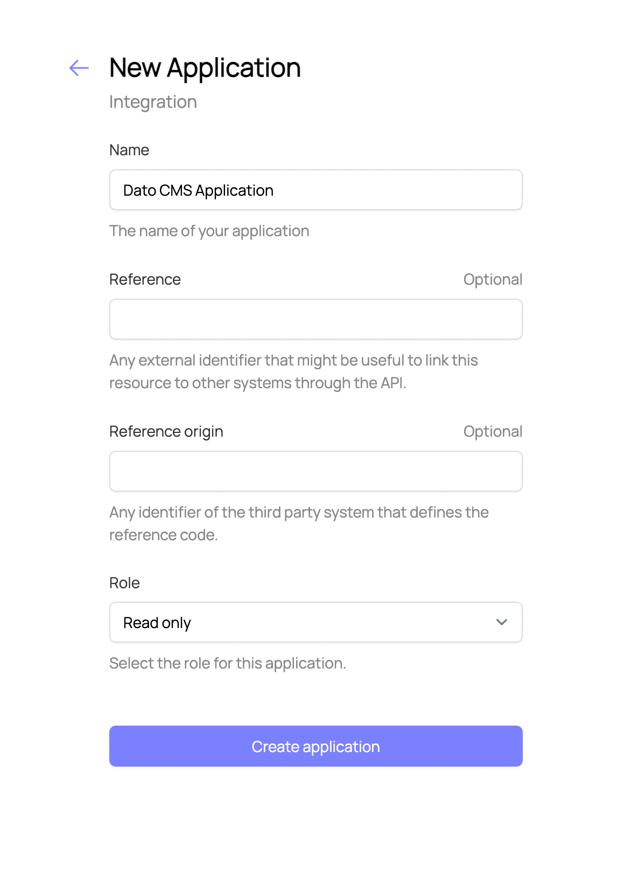
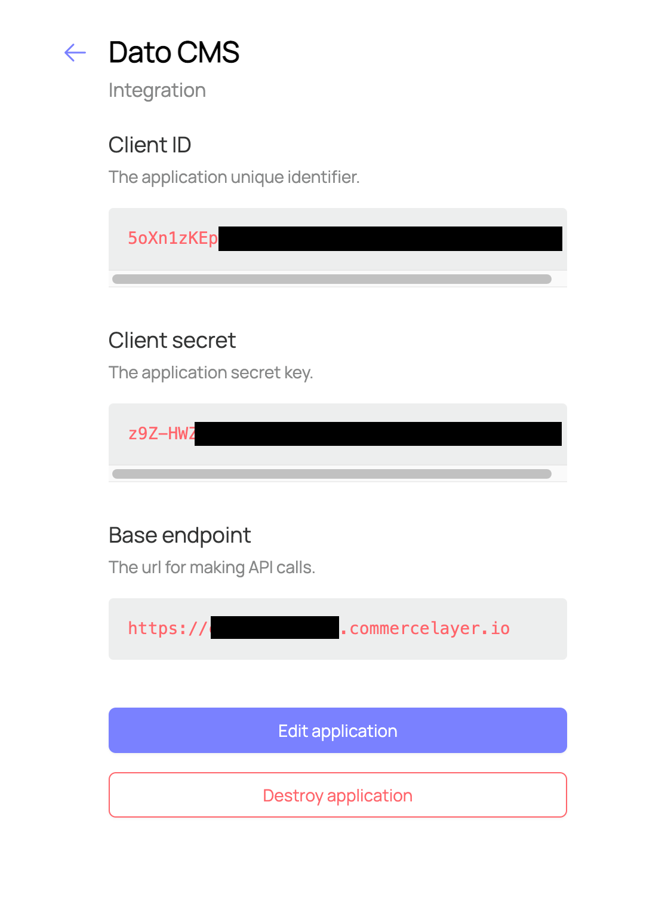
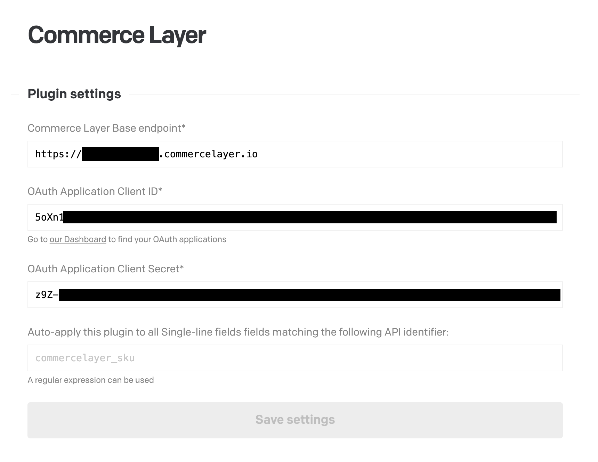

# DatoCMS Commerce Layer plugin

A plugin that allows users to search and select Commerce Layer SKUs.

## Credentials (Commerce Layer)

Go in your Commerce Layer dashboard > Organization > Integration and create a new `datocms` application. It should look something like this:

Get the application's Base endpoint, Client ID ans Client secret:

## Configuration (DatoCMS)

Please specify your Commerce Layer parameters in the plugin settings:

You can either hook this plugin manually to your single-line fields, or specifying an automatic match rule based on the API key.
