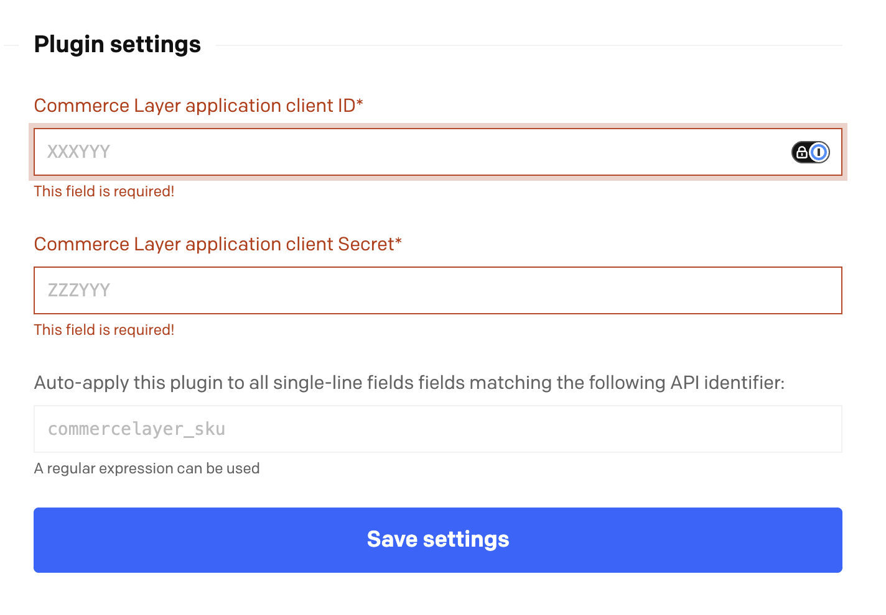
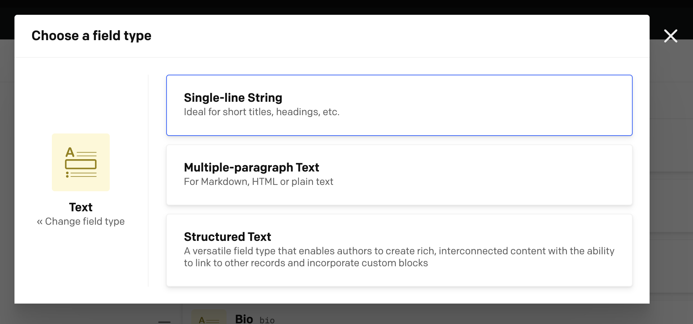
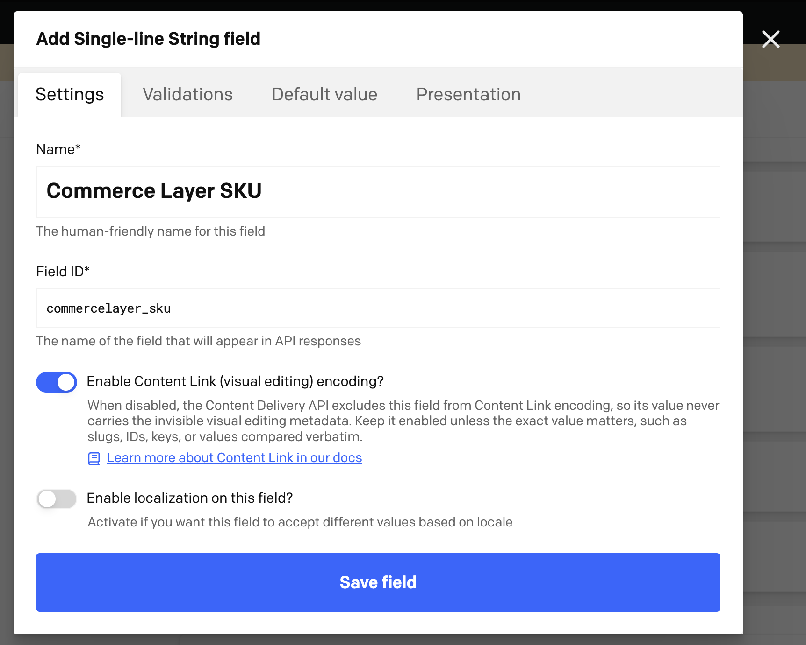
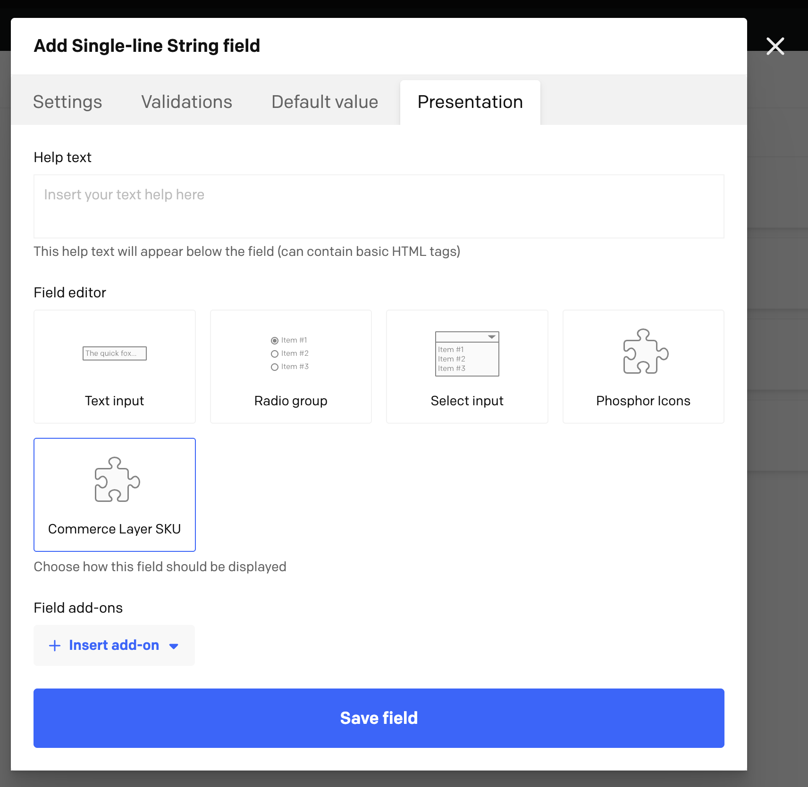
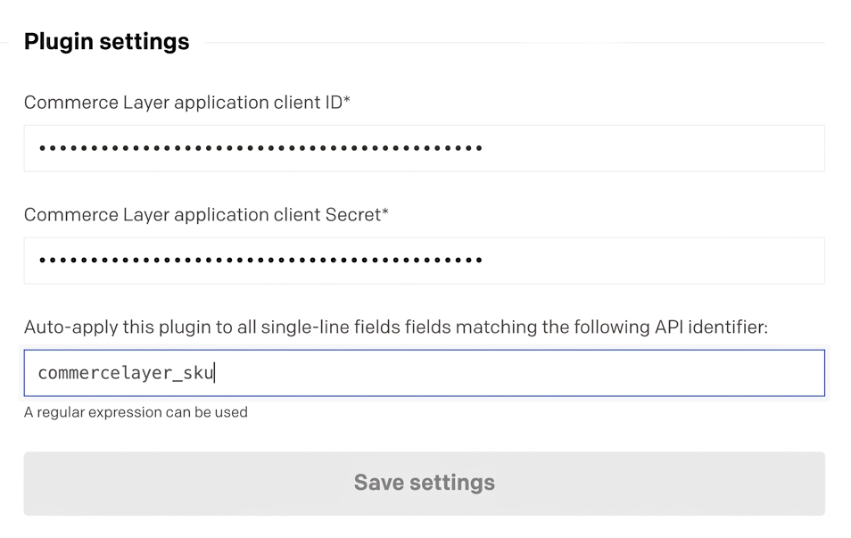

# DatoCMS Commerce Layer plugin

The DatoCMS Commerce Layer plugin allows users to search and select Commerce Layer SKUs and linking them to content data in DatoCMS.

## What is Commerce Layer?

[Commerce Layer](https://commercelayer.io) is a multi-market commerce API and order management system that lets you add global shopping capabilities to any website, mobile app, chatbot, wearable, voice, or IoT device, with ease. Compose your stack with the best-of-breed tools you already mastered and love. Make any experience shoppable, anywhere, through a blazing-fast, enterprise-grade, and secure API.

## Commerce Layer oauth credentials

1. Create a [DatoCMS account](https://dashboard.datocms.com/signup) if you haven't yet and add a new project.

2. Create a [Commerce Layer account](https://dashboard.commercelayer.io/sign_up) if you haven't already.

3. If you haven't already, kindly follow this [onboarding guide](https://docs.commercelayer.io/core/onboarding/guided-setup) to learn how to set up your Commerce Layer organization.

4. In the Commerce Layer dashboard, click on the **Developers > API credentials** menu and create an API Credential of type **Integration** with the name: `DatoCMS` and role: `Read only`.

5. Upon successful creation, you will get a `CLIENT ID` and a `CLIENT SECRET` credentials. Kindly remember to save these, as you'll need them later.

> **BACKWARD COMPATIBILITY** — Please note that if you are upgrading from a previous version (older than `v2.0.0`) you need to change your plugin settings to use an _integration_ app because old _datocms_ Commerce Layer apps have been dismissed and don't work with the new versions of the plugin.

## Plugin configuration (DatoCMS)

1. Visit [this page](https://www.datocms.com/marketplace/plugins/i/datocms-plugin-commercelayer) and click on the "Install plugin" button.

2. Choose where to install the plugin by selecting the desired **Project**.

3. You will be redirected to a new page, the plugin configuration page, where you can enter your previously saved Commerce Layer `CLIENT ID` and `CLIENT SECRET` credentials to complete the installation.

4. You can now hook this plugin manually to your single-line fields, or specify an identifier and use it to create an automatic match rule (e.g. via regex).

## Usage

To use the plugin you need to add a single-line text field to your model in DatoCMS and select _Commerce Layer SKU_ from the dropdown menu in the _Presentation_ tab:

Otherwise, in the plugin configuration page, you can setup a regex to identify the fields to enable the plugin behavior for.

Now you can browse your Commerce Layer organization SKUs, search and select them from the UI. You can also create and add new SKUs by clicking the button that redirects to Commerce Layer admin dashboard:

The selected SKU's main information will then show in the related record:

