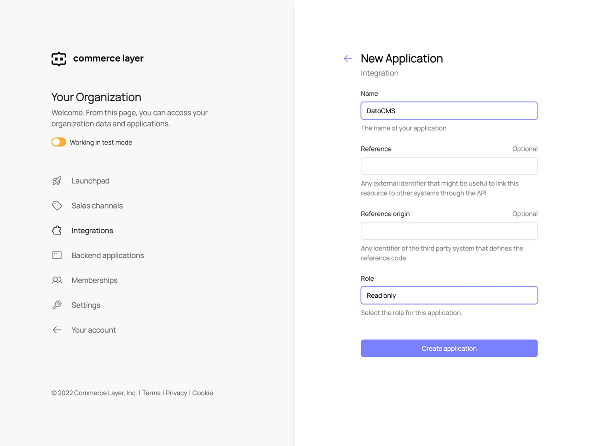
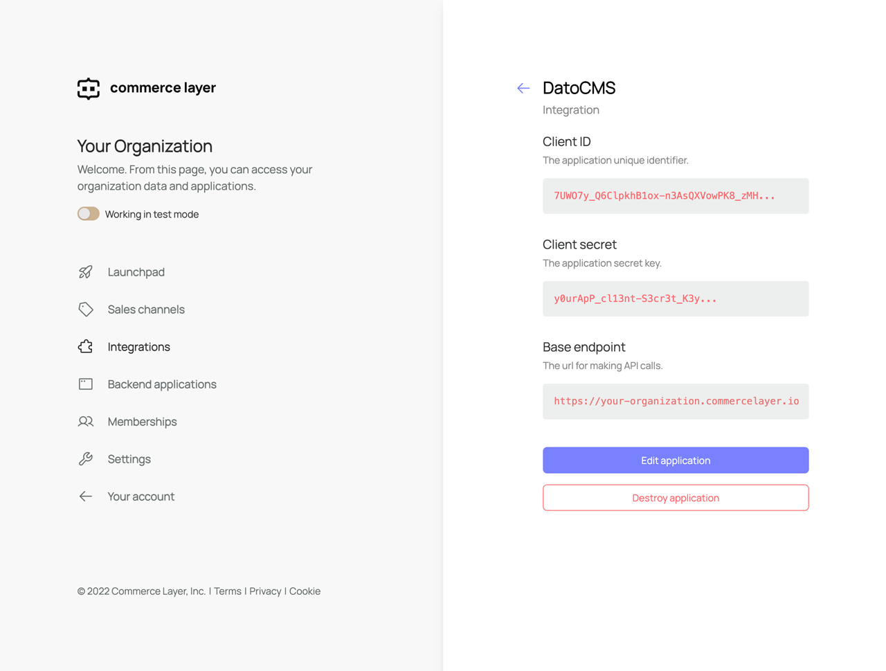
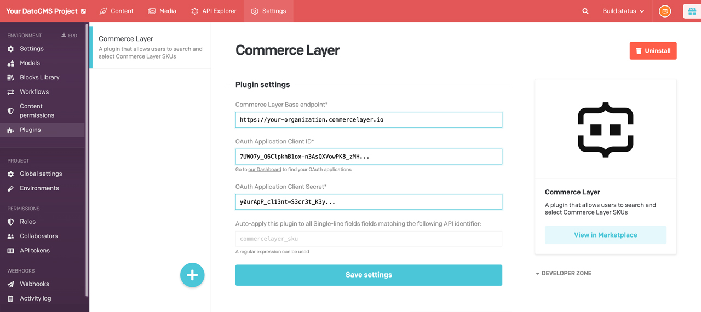
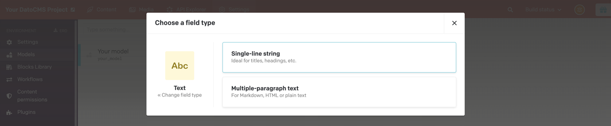
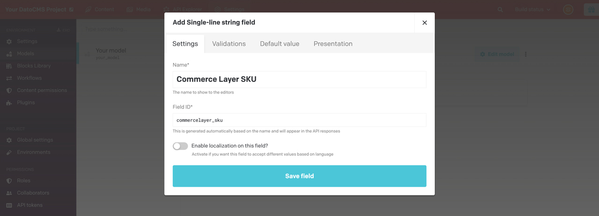
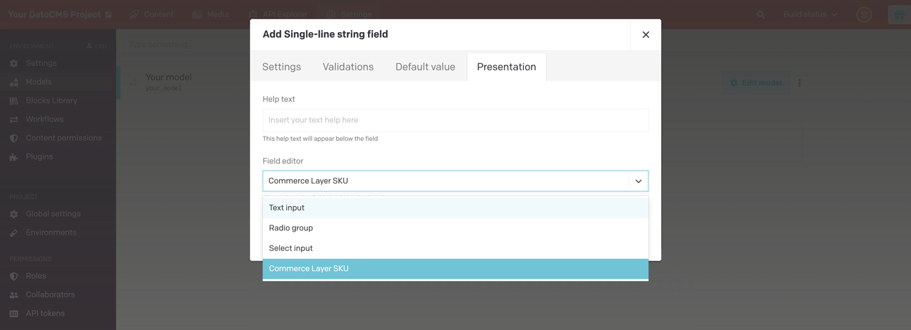

# DatoCMS Commerce Layer plugin

A plugin that allows users to search and select Commerce Layer SKUs.

## App credentials (Commerce Layer)

To use this plugin first you need to create a Commerce Layer OAuth application and take note of its credentials. If you don't have a Commerce Layer account you can sign up for free [here](https://dashboard.commercelayer.io/sign_up) and follow the [onboarding tutorial](https://docs.commercelayer.io/developers/welcome/onboarding-tutorial) to create an organization and seed it with test data. Once successfully signed in to the Commerce Layer admin dashboard, go into your organization's _Integrations_ section and create a new integration app with role _Read only_:

Now you can access the application's base endpoint, client ID, and client secret:

> **BACKWARD COMPATIBILITY** — Please note that if you are upgrading from a previous version (older than `v2.0.0`) you need to change your plugin settings to use an _integration_ app because old _datocms_ Commerce Layer apps have been dismissed and don't work with the new versions of the plugin.

## Plugin configuration (DatoCMS)

You can search the plugin from the DatoCMS admin dashboard or install it from the [marketplace](https://www.datocms.com/marketplace/plugins/i/datocms-plugin-commercelayer). Once installed, you need to configure the plugin with the credentials you get from Commerce Layer app you previously created:

You can either hook this plugin manually to your single-line fields, or specify an identifier and use it to create an automatic match rule (e.g. via regex).

## Usage

To use the plugin you need to add a single-line text field to your model in DatoCMS and select _Commerce Layer SKU_ from the dropdown menu in the _Presentation_ tab:

Now you can browse your Commerce Layer organization SKUs, search and select them from the UI. You can also create and add new SKUs by clicking the button that redirects to Commerce Layer admin dashboard:

The selected SKU's main information will then show in the related record:

